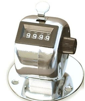

# Example 3: Actors vs classes

We now turn to classes and actors, which, as we have already mentioned, 
have some similarities, but also major differences. We consider a 
classical example of an object with state, the counter. 


 
The counter allows three operations: its value can be `inc`reased
by one (the ``button'' on top), `reset` to zero (the knob on the right) or
`read` (the display). The use case for this particular variant of a counter is
to keep track of the number of inc's performed since the counter was last reset.
 
Below are two valid Acton definitions, modelling the counter. The left
one is also a valid class definition in Python. We also show some
simple, typical use of the definitions.

```py
class CounterC():                               actor CounterA(initval=0):
                                           
    def __init__(self,initval=0):                 var val = initval
        self._val = initval                
                                           
    def inc(self):                                def inc():
        self._val += 1                                val += 1
                                           
    def read(self):                               def read():
        return self._val                              return val
                                              
    def reset(self):                              def reset():
        self._val = 0                                 val = 0
                                           

actor main(env):                               actor main(env)             
    c = CounterC(5)                                a = CounterA(5)
    c.inc()                                        a.inc()
    c.inc()                                        a.inc()
    v = c.read()                                   v = a.read()
    print(v) # prints 7                            print(v)  # prints 7
                                           
```
 
We see striking similarities and some minor differences between the two
definitions:
* Most strikingly, the definitions are used in exactly the same way: we
  create a class instance/an actor with initial value 5, we increase its
  value twice and finally read the counter value, which in both cases
  will be 7.

* The definitions of methods are almost
  the same; the differences are the occurrences of `self` in the
  class (and our choice of having an underscore in the name of the
  instance variable).

* There is no `__init__` method in the actor definition;
  instead the optional initial value is a parameter to the actor name.
  Thus parameters in an actor definition have another meaning than in a class
  definition (where they denote superclasses).
 
* The state variable `val` is explicitly declared in the actor definition,
  introduced by the keyword `var`.
 
Thus, we can use both class and actor definitions to create objects with
state that can be manipulated and accessed through methods. But the
syntax and the similaritites tend to downplay the fundamental difference
between the two concepts:

* The method call `c.inc()` is essentially an ordinary function
  call (with the receiving object as first parameter). A thread that
  executes this call will transfer control to the function body, execute
  the body, which will update the state variable, and continue.

* The statement `a.inc()`, on the other hand, looks exactly the
  same but denotes the sending of the message `inc()` to the
  actor `a`. A thread executing the call will ask the runtime
  system for this service and proceed immediately with the next
  statement. The message will be queued and the actual increase of
  `a`'s state will be done at some later point in time,
  probably by some other thread.
 
This difference means that the actor `a` can be used as a member
of the community of actors comprising a program, providing the service
of a shared counter. It keeps track of the number of `inc`
messages received, for which it can be queried in a `read` message.
 
The class instance, on the other hand, can ***not*** be safely used in this
way. Imagine that we could create class instance `c` and place it as a
top level member in a community of actors. Since the operation of
increasing the value of an integer variable is not thread-safe, it is
conceivable that two concurrent threads, doing message processing for
actors using the class instance, will execute `c.inc()` in
parallel, both read the same `_val` and increase it by 1 before
writing back, with
the net result that the two calls will only increase the counter by one.
 
The conclusion is that classes and class instances do have a role to
play in Acton: instances can be used as (part of) the internal
state in actors, but not as replacement for actors. To illustrate this
point in an exaggerated way, the following would be a legitimate and
safe use of class `CounterC`:
 
```py
actor CounterA(initval = 0):

    var c = CounterC(initval)

    def inc():
        c.inc()

    def read():
        return c.read()

    def reset():
        c.reset()
```
 
Here, there is no risk of multiple threads causing problems, since the
calls to `c`'s methods occur within the processing of an
actor message. We certainly do not recommend this design, since the
example is too trivial. The internal
state of the actor is as easily modelled by an integer variable, so the
use of a class instance here seems to offer no advantage. For an
example where a class instance would be a natural choice as
state we can think of a sorted container (set, list or dictionary or
...), i.e. a container which also supports an operation to retrieve its
elements in sorted order. Here some form of binary search tree would be a
natural candidate to represent the state. More generally, any data
structure implemented as a class can be made thread-safe by wrapping
it in an actor as indicated here.

## On templates, instances and message passing
 
A class declaration is a template for
objects. Every time we execute `c = CounterC()` we get a new
***instance*** of the class `CounterC` with its own copy of
the state `_val`.
 
The situation is the same for actors. Executing `a  =
CounterA()` creates a new actor instance of the "actor class"
`CounterA` with its own copy of the
state `val`. However, following established terminology but
maybe a bit confusing at first, we refer also to the instance just as an actor.
 
The syntax for sending a message to an actor `b`,
where `b` is an instance of actor (class) `B`, is
`b.m(args)`, where `m` must be a method declared in `B`
and `args` are suitable arguments. Thus, actor 
`a` can only send a message to actor
`b`, if `a`  knows the name of 
`b`. This can be obtained in only two ways:

* The name is obtained when `b` is created, as in 
  `b = CounterA()`. The name is completely opaque; there are no
  operations that apply to it and it cannot be programmatically
  constructed. Thus, if  `a`  actually created
  `b`, then `a` knows the name of, and can send messages
  to, `b`.

* The only other way that `a` may know the name
  is that it has received the name in a message, from an actor who
  already knows `b`. That actor could possibly be `b`
  itself, using the reserved word `self`.

If `a` sends two asynchronous
messages to `b`, the first message sent is guaranteed to be delivered
before the second. But this is the only guarantee that Acton makes as
to delivery order. If a third actor `c` also sends messages to
`b`, nothing can be said about the arrival order between two
messages with distinct senders. To be a bit more concrete, consider a
community of worker actors that use a `CounterA` actor `a` to keep track
how many times a certain task has been performed. To this end, all the 
workers call `a.inc()` each time they have completed the
task. We consider two scenarios:

* A method call `a.read()` which is done when 
  the system is idle, will accurately report how many tasks have
  been completed.

* Regardless of the state of the system, if one of the workers
  calls `a.read()`, the returned value will certainly include
  all tasks completed and reported by that worker. For task
  completions reported by other workers, we cannot say whether 
  tasks completed ``recently'' will have been counted or whether the
  corresponding `a.inc()` messages remain in `a`'s
  mailbox, to be processed after the reading of the counter.
